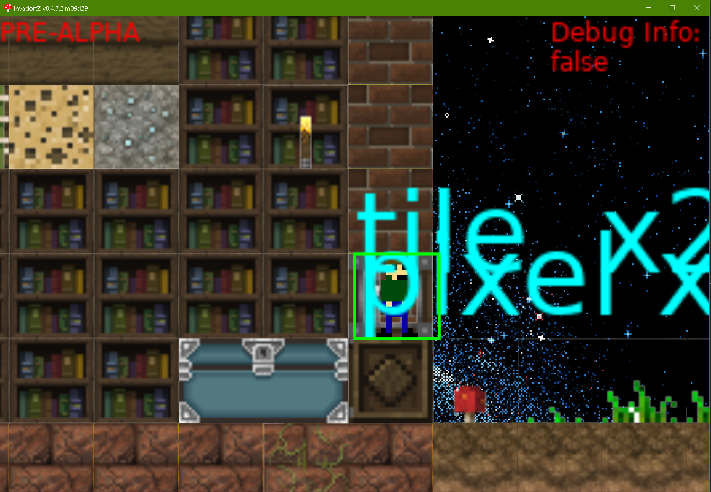

# Invadors

Easy to use, it will make you more attractive and you feel sensual doing so.

A Love2D platformer game prototype I wrote to learn more about game programming while travelling Europe.

## Project Overview

Invadors is a state-driven Love2D game that demonstrates various game development concepts through multiple mini-games and experimental features. The project uses a modular architecture with clear separation of concerns.

## Installation / Starting the Game

```
git clone git@github.com:mikelyons/invadors.git
```

Then inside the `invadors` directory:

there are 3 run.bat files that do different things for different platforms

#### Windows

- `run1.bat` starts the game in LOVE 10.2
- `run2.bat` starts the game in LOVE 11.3
- `run3.bat` starts the game in LOVE 10.2 with color terminal logging (windows only)

#### MacOS

- `run.command`  starts with 10.2
- `run2.command` starts with 11.3

MacOS may not support color terminal logging

Continuing development during the 2020 pandemic

:scream:

## Project Structure

```
invadors/
├── src/                    # Core game source code
│   ├── core/              # Essential game systems
│   │   ├── constants.lua  # Global constants and configuration
│   │   ├── dependencies.lua # Dependency loading
│   │   ├── logging.lua    # Logging system
│   │   └── devDependencies.lua # Development dependencies
│   ├── utils/             # Utility functions and helpers
│   │   ├── particles/     # Particle system
│   │   ├── cutscene.lua   # Cutscene system
│   │   └── Examples/      # Example code
│   ├── assets/            # Game assets (organized by type)
│   │   ├── audio/         # Audio assets
│   │   └── asset_manifest.lua # Asset registry
│   └── states/            # Game states (modes/features)
├── lib/                   # Third-party libraries
├── tools/                 # Development tools and utilities
├── docs/                  # Documentation
├── experiments/           # Experimental code and prototypes
├── assets/                # Game assets (images, audio, etc.)
└── states/                # Game states (legacy location)
```

## Documentation

- [Project Overview](docs/README.md) - Detailed project architecture
- [Dependencies](docs/dependencies.md) - Library and dependency information
- [State Management](docs/state_management.md) - How states work and how to create them
- [Development Guidelines](docs/development_guidelines.md) - Coding standards and best practices
- [TODO List](docs/TODO.md) - Current tasks and future improvements

## What I've Learned

* Tilemaps and sprites
* How to roll you own basic 2D collisions
* Edge cases when applying gravity
* How gravity is simulated in a non-realistic fashion in platformer games
* Common pitfalls and the importance of optimisation in videogames
* Created a mini-map UI with the relative position of the player and the world elements
* Splash screens and audio
* Lots about Love2d! (will explain in a later update)

## Game States

The game includes many different states, each representing a different game mode or feature:

### Core States
- **Menu**: Main menu system
- **Pause**: Pause screen
- **Splash**: Splash screen
- **CreateWorld**: World creation interface

### Game Modes
- **asciiGame**: ASCII-based game mode
- **synth**: Synthesizer/audio game
- **prog2**: Programming game mode
- **generate**: Procedural generation demo
- **space1**: Space-themed game mode
- **worldMap**: World map interface

### Experimental States
- **bizzaro**: Experimental game mode
- **kitchen**: Kitchen simulation
- **drivingSim**: Driving simulation
- **characterCreation**: Character creation
- **characterCustomizer**: Character customization

See [State Management Documentation](docs/state_management.md) for more details.

#### Libraries Used

- Middleclass - Object-oriented programming
- Stateful - State machine implementation
- Denver - Additional utilities

#### Game Dev Tools Used

- Piskel App - https://www.piskelapp.com/

#### Libraries under consideration

- https://github.com/arthurealike/turtle.lua
- https://opensourcelibs.com/lib/lua-namegen
- gif writer - https://love2d.org/forums/viewtopic.php?t=82460 - https://github.com/WetDesertRock/GifCat
- ruby string methods for lua - https://github.com/mebens/strong

#### Tools under consideration

- http://pixelatorapp.com/download.html
- https://github.com/flamendless/love-fuser - nightly builds
- https://github.com/flamendless/moonshine - post-processing effects

## Development

### Adding New States
1. Create a new directory in `states/` or a single file
2. Implement the state interface (init, update, draw, etc.)
3. Register the state in `game.lua`
4. Test the state loads and transitions correctly

### Code Style
- Use snake_case for file and variable names
- Follow the patterns established in existing code
- Document complex logic with comments
- Keep states self-contained

See [Development Guidelines](docs/development_guidelines.md) for detailed standards.

## Screenshots

#### Adventure Mode



## Contributing

Please read the [Development Guidelines](docs/development_guidelines.md) before contributing. The project follows specific coding standards and architectural patterns.

## License

See the LICENSE file for details.

